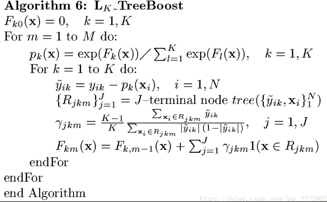

###GBDT 算法梳理
前向分布算法
负梯度拟合
损失函数
回归
多分类
正则化
sklearn参数

----------
>#####前向分布算法 

----------
>#####负梯度拟合
对于一般的回归树，采用平方误差损失函数，这时根据前向分布每次只需要达到最优化，就能保证整体上的优化。由于平方误差的特殊性，可以推导出每次只需要拟合残差（真实值-预测值）。梯度提升树：而对于其他损失函数，提出了利用负梯度表示残差的近似值。为什么采用损失函数的负梯度？
L(y,f(x))中将f(x)看成一个参数，为了使L损失函数最小，采用梯度下降的方法即：f(x)_m=f(x)_m-1-(dL/df(x)) 与一般的梯度下降法相同
而f(x)_m=f(x)_m-1+T(x;Q)//Q为前向分布法每次得到这棵树的参数，T(x;Q)为训练的新树所以有f(x)_m-1+T(x;Q)=f(x)_m-1-(dL/df(x))所以有T(x;Q)=-(dL/df(x))
左边为预测值，右边为真实值，所以整个过程就变成了每次拟合损失函数的负梯度的值。所以可以将这种方法看成一般损失函数的情况，而平方损失是特殊的情况（拟合残差）。

----------
>#####损失函数

--------
>#####多分类

--------
>#####正则化
第一种是和Adaboost类似的正则化项，即步长(learning rate)。定义为νν,对于前面的弱学习器的迭代fk(x)=fk−1(x)+hk(x)fk(x)=fk−1(x)+hk(x)。如果我们加上了正则化项，则有fk(x)=fk−1(x)+νhk(x)fk(x)=fk−1(x)+νhk(x)
　　ν的取值范围为0<ν≤10<ν≤1。对于同样的训练集学习效果，较小的νν意味着我们需要更多的弱学习器的迭代次数。通常我们用步长和迭代最大次数一起来决定算法的拟合效果。
　　第二种正则化的方式是通过子采样比例（subsample）。取值为(0,1]。注意这里的子采样和随机森林不一样，随机森林使用的是放回抽样，而这里是不放回抽样。如果取值为1，则全部样本都使用，等于没有使用子采样。如果取值小于1，则只有一部分样本会去做GBDT的决策树拟合。选择小于1的比例可以减少方差，即防止过拟合，但是会增加样本拟合的偏差，因此取值不能太低。推荐在[0.5, 0.8]之间。使用了子采样的GBDT有时也称作随机梯度提升树(Stochastic Gradient Boosting Tree, SGBT)。由于使用了子采样，程序可以通过采样分发到不同的任务去做boosting的迭代过程，最后形成新树，从而减少弱学习器难以并行学习的弱点。
　　第三种是对于弱学习器即CART回归树进行正则化剪枝

--------
>#####sklearn参数
在sacikit-learn中，GradientBoostingClassifier为GBDT的分类类， 而GradientBoostingRegressor为GBDT的回归类。两者的参数类型完全相同，当然有些参数比如损失函数loss的可选择项并不相同。这些参数中，类似于Adaboost，GBDT类库boosting框架参数。首先，我们来看boosting框架相关的重要参数，由于GradientBoostingClassifier和GradientBoostingRegressor的参数绝大部分相同。
	1) n_estimators: 也就是弱学习器的最大迭代次数，或者说最大的弱学习器的个数。一般来说n_estimators太小，容易欠拟合，n_estimators太大，又容易过拟合，一般选择一个适中的数值。默认是100。在实际调参的过程中，我们常常将n_estimators和下面介绍的参数learning_rate一起考虑。
	2) learning_rate: 即每个弱学习器的权重缩减系数ν，也称作步长，在原理篇的正则化章节我们也讲到了，加上了正则化项，我们的强学习器的迭代公式为fk(x)=fk−1(x)+νhk(x)。ν的取值范围为0<ν≤1。对于同样的训练集拟合效果，较小的ν意味着我们需要更多的弱学习器的迭代次数。通常我们用步长和迭代最大次数一起来决定算法的拟合效果。所以这两个参数n_estimators和learning_rate要一起调参。一般来说，可以从一个小一点的ν开始调参，默认是1。
	3) subsample: 即我们在原理篇的正则化章节讲到的子采样，取值为(0,1]。注意这里的子采样和随机森林不一样，随机森林使用的是放回抽样，而这里是不放回抽样。如果取值为1，则全部样本都使用，等于没有使用子采样。如果取值小于1，则只有一部分样本会去做GBDT的决策树拟合。选择小于1的比例可以减少方差，即防止过拟合，但是会增加样本拟合的偏差，因此取值不能太低。推荐在[0.5, 0.8]之间，默认是1.0，即不使用子采样。
	4) init: 即我们的初始化的时候的弱学习器，拟合对应原理篇里面的f0(x)，如果不输入，则用训练集样本来做样本集的初始化分类回归预测。否则用init参数提供的学习器做初始化分类回归预测。一般用在我们对数据有先验知识，或者之前做过一些拟合的时候，如果没有的话就不用管这个参数了。
	5) loss: 即我们GBDT算法中的损失函数。分类模型和回归模型的损失函数是不一样的。
   　对于分类模型，有对数似然损失函数"deviance"和指数损失函数"exponential"两者输入选择。默认是对数似然损失函数"deviance"。在原理篇中对这些分类损失函数有详细的介绍。一般来说，推荐使用默认的"deviance"。它对二元分离和多元分类各自都有比较好的优化。而指数损失函数等于把我们带到了Adaboost算法。
	对于回归模型，有均方差"ls", 绝对损失"lad", Huber损失"huber"和分位数损失“quantile”。默认是均方差"ls"。一般来说，如果数据的噪音点不多，用默认的均方差"ls"比较好。如果是噪音点较多，则推荐用抗噪音的损失函数"huber"。而如果我们需要对训练集进行分段预测的时候，则采用“quantile”。
	6) alpha：这个参数只有GradientBoostingRegressor有，当我们使用Huber损失"huber"和分位数损失“quantile”时，需要指定分位数的值。默认是0.9，如果噪音点较多，可以适当降低这个分位数的值。
